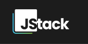
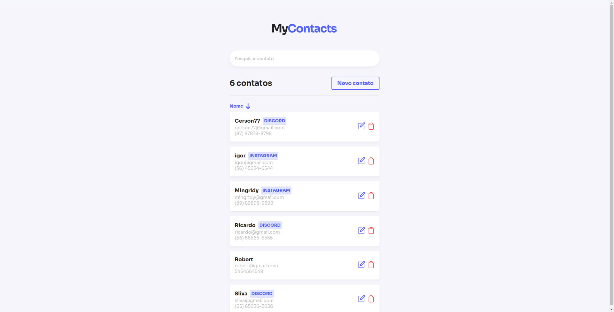
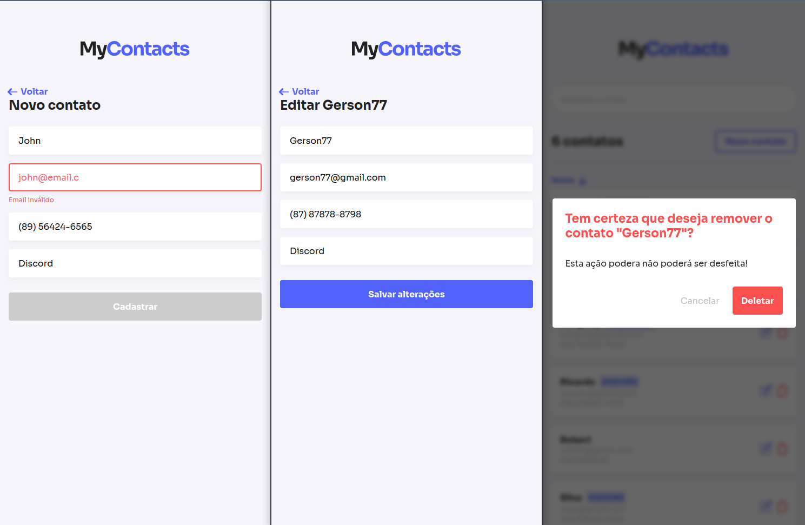
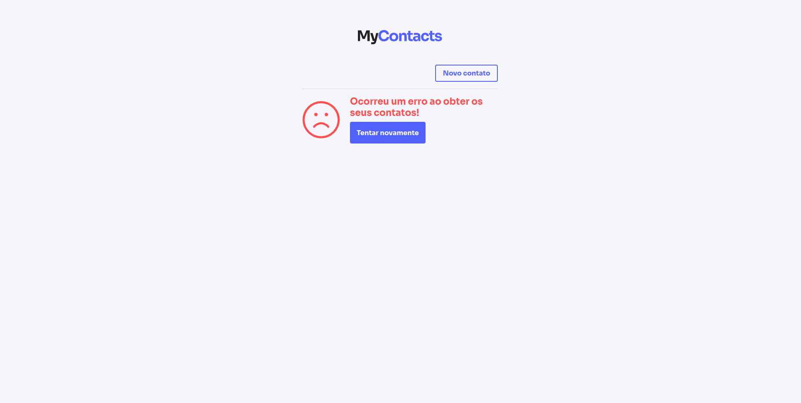

# Projeto MyContacts

### Projeto é uma lista de contatos

Projeto desenvolvido no curso [JStack](https://jstack.com.br/) <span></span> do Mateus Silva, usando as técnologias React no Frontend e NodeJs no Backend. Aplicação conta com diversos conceitos básicos como instalação de dependencias de desenvolvimento para padronizar o código, até desenvolvimento de técnicas avançadas como custom hooks e tratamentos de erros. 

## Página inicial:
<h1>
    
</h1>


## Apresentão responsiva das páginas:
<h1>
    
</h1>

# Aviso em caso de falha na comunicação com o servidor:
<h1>
    
</h1> 

### **Instruções para executar o projeto**:

Execute os comando abaixo:

```bash
# Criando o container docker para banco de dados:

$ docker run --name pg -e POSTGRES_USER=root -e POSTGRES_PASSWORD=root -p 5432:5432 -d postgres

# Execute as querys abaixo para criar o database, tabelas e colunas:

# Acessando o container:

$ docker exec -it pg bash

root@3941267ccf99:/# psql -U root

# Conferindo as databases:

root=# \l

# Criando a database:

root=# CREATE DATABASE mycontacts;

# Acessando a database:

root=# \c mycontacts

# Instalando o módulo para ids default:

CREATE EXTENSION IF NOT EXISTS "uuid-ossp";

# Criando a tabela de categorias:

root=# CREATE TABLE IF NOT EXISTS categories (
  id UUID NOT NULL UNIQUE DEFAULT uuid_generate_v4(),
  name VARCHAR NOT NULL
);

# Criando a tabela de contatos:

root=# CREATE TABLE IF NOT EXISTS contacts (
  id UUID NOT NULL UNIQUE DEFAULT uuid_generate_v4(),
  name VARCHAR NOT NULL,
  email VARCHAR UNIQUE,
  phone VARCHAR,
  category_id UUID,
  FOREIGN KEY(category_id) REFERENCES categories(id)
);

-----------------------------------------------------
| ## Agora podemos clonar o projeto e iniciar a aplicação ## |
-----------------------------------------------------

# Clonando o repositório
$ git clone https://github.com/Gerson77/mycontacts.git

# Entre nos diretórios
$ cd diretório

# Crie um arquivo .env com a url da API no diretório client(Frontend)

$ touch .env

# Conteúdo do arquivo
REACT_APP_URL_API="http://localhost:3001"

# Instalar as dependências
$ init i

# Iniciando o projeto no server(Backend):
$ npm run dev

# Iniciando o projeto no client(Frontend):

$ npm run start
```
